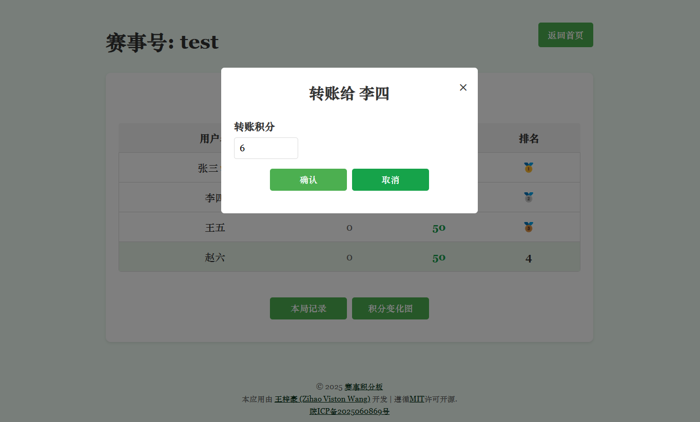

# 赛事积分板 (Scoreboard)

一个实时、灵活的赛事积分统计应用。

© 2025 [赛事积分板](https://github.com/ZihaoVistonWang/scoreboard)

## 项目发布页

- 我的个人主页：
  - [https://zihaowang.cn/zh/post/scoreboard/](https://zihaowang.cn/zh/post/scoreboard/)
  - [https://zihao.viston.wang/zh/post/scoreboard/](https://zihao.viston.wang/zh/post/scoreboard/)
- GitHub:
  - [https://github.com/ZihaoVistonWang/scoreboard](https://github.com/ZihaoVistonWang/scoreboard)

## 预览地址

- 🧮 [赛事积分板 (Scoreboard)](https://scoreboard.zihao.viston.wang/)

  - 🔍由于服务器资源紧张，本预览地址不一定永久服务。若链接失效或服务关闭时，您还想继续体验，请在本页面最下方给我留言，我将第一时间与您答复，并视情况启动该服务。
  - ⚠️本服务的密码加密为明文传输，为了防止网络安全事件发生，请不要使用您的常用用户名或密码体验！

## 应用展示


<p style="text-align: center;">图1  转账页面</p>


<p style="text-align: center;">图2  积分列表与积分变化图</p>


<p style="text-align: center;">图3  积分列表与本局记录</p>

## 代码仓库

- 本项目遵循[MIT](https://github.com/ZihaoVistonWang/scoreboard/blob/main/LICENSE)许可开源。
- 点击访问[GitHub仓库](https://github.com/ZihaoVistonWang/scoreboard)。

## 功能特性

1. **首页**
   - 用户从现有用户列表中选择，也可以添加新用户
   - 创建新赛事或加入已有赛事
   - 创建赛事时可设置所有用户的初始积分（默认为50分）
   - 支持设置“零和”和“非零和”积分模式
   - 可选密码保护用户账号（6位数字）

2. **赛事房间页面**
   - 显示赛事中所有用户的积分和排名
   - 当前用户高亮显示
   - 房主用户显示特殊标识（👑）
   - 点击其他用户可以转账积分
   - 实时自动更新积分列表
   - 显示上一局的积分变化
   - 查看本局积分转账记录
   - 查看积分变化图表
   - 支持负分记录，用户可以转出超过自己拥有的积分

3. **比赛管理**
   - 房主可以控制“下一局”和“结算”功能
   - 支持多轮比赛记录
   - 生成详细的结算报告
   - 访客模式允许非参与者观看赛事

## 安装与运行

### 前提条件

- Python 3.6+
- Flask

### 安装依赖

```bash
pip install flask
```

### 运行应用

使用Python直接运行:
```bash
python app.py
```

启动后，在浏览器中访问 http://127.0.0.1:16868 即可使用。

## 项目结构

```
/
├── app.py              # Flask应用主程序
├── /templates/         # HTML模板
│   ├── index.html      # 首页
│   ├── room.html       # 房间页面
│   └── error.html      # 错误页面
├── /static/            # 静态资源
│   ├── /css/           # 样式表
│   └── /js/            # JavaScript文件
│       ├── chart-manager.js   # 图表管理
│       ├── logs-manager.js    # 日志管理
│       ├── room-manager.js    # 房间管理
│       ├── settlement.js      # 结算功能
│       └── main.js            # 主脚本
└── /data/              # 存储赛事数据（JSON格式）
```

## 使用说明

1. **创建或加入赛事**
   - 选择已有用户或添加新用户
   - 可选添加6位数字密码保护账号
   - 创建赛事时可设置每个用户的初始积分（默认50分）和零和/非零和模式
   - 点击“创建赛事”“加入赛事”或“观看赛事”按钮

2. **赛事房间内操作**
   - 积分转账：点击其他用户，输入转账金额并确认
   - 查看记录：点击“本局记录”查看当前局的转账详情
   - 积分图表：点击“积分变化图”查看积分变化趋势
   - 下一局：房主可点击“下一局”开始新一轮比赛（当可用时）
   - 结算：房主可点击“结算”生成当前阶段的结算报告（当可用时）

3. **特殊功能**
   - 访客模式：无需注册，可实时观看赛事进展
   - 结算报告：可展开查看历史结算报告详情
   - 房主权限：拥有比赛进程控制权

## 安全与数据
- 所有数据以JSON格式存储在data目录
- 可选的密码保护用户账号
